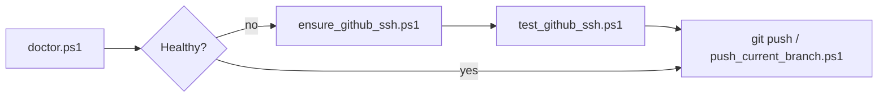

# Windows GitHub SSH Setup Toolkit

**A Windows-first toolkit for diagnosing and fixing GitHub SSH, ssh-agent, remote URL, and branch push problems.**

[](https://github.com/Kozphy/Windows-GitHub-SSH-Setup-Toolkit/releases/latest)

This repository is **beginner-friendly**, **safe-by-default**, and structured like a small internal developer-productivity tool you might ship on a platform team: diagnose first, explain clearly, and avoid destructive Git operations.

**Current release:** [v1.0.0](https://github.com/Kozphy/Windows-GitHub-SSH-Setup-Toolkit/releases/tag/v1.0.0) · See [CHANGELOG.md](CHANGELOG.md)

---

## Before / After (what “fixed” looks like)

Broken Windows SSH setup often looks like a wall of unrelated errors. This toolkit collapses that into one readable checklist.

<table>
<tr>
<td width="50%">

**Before** — agent down, auth failing

```text
[WARN] ssh-agent is not running
[WARN] No SSH key loaded in agent
[WARN] GitHub SSH authentication not confirmed
```

```text
git@github.com: Permission denied (publickey).
```

</td>
<td width="50%">

**After** — one-shot repair path

```text
[OK] ssh-agent running
[OK] SSH key loaded (ssh-add -l)
[OK] GitHub authentication succeeded
[OK] origin uses SSH
```

```text
Hi YOU! You've successfully authenticated,
but GitHub does not provide shell access.
```

</td>
</tr>
</table>

Typical repair on a broken machine:

```powershell
.\scripts\doctor.ps1
.\scripts\ensure_github_ssh.ps1   # may show a UAC prompt
.\scripts\fix_git_ssh_command.ps1 # if ssh -T works but git push fails
.\scripts\doctor.ps1              # expect all [OK]
```

Full sample transcripts: [`examples/before-doctor.txt`](examples/before-doctor.txt) → [`examples/after-doctor.txt`](examples/after-doctor.txt)



---

## 1. Why this exists

Windows developers often follow the same tutorial path—then get stuck in a loop of confusing messages:

- `Could not open a connection to your authentication agent`
- `Permission denied (publickey)`
- `The agent has no identities`
- “I committed locally, but GitHub does not show my branch”
- A scary-looking GitHub line that says **“GitHub does not provide shell access”** (usually **not** a failure)

This toolkit gives you **one consistent place** to look: scripts for checks, docs for meaning, and examples of what “good” looks like.

---

## 2. What problems it solves

- **ssh-agent** not running or not usable
- **SSH key not loaded** into the agent (`ssh-add`)
- **Wrong `origin` remote URL** (especially switching toward `git@github.com:OWNER/REPO.git`)
- **GitHub SSH authentication confusion** (interpreting GitHub’s SSH banner correctly)
- **Local commits not pushed** (setting upstream safely with confirmation)

---

## 3. Quick start

Requirements:

- Windows 10/11
- PowerShell (5.1+; PowerShell 7 is fine)
- Git for Windows + OpenSSH client (typical)

From a clone of this repository:

```powershell
cd Windows-GitHub-SSH-Setup-Toolkit
.\scripts\doctor.ps1
```

For a full report:

```powershell
.\scripts\diagnose_ssh.ps1
```

> **No Python** and **no package installs** are required for v1.

---

## 4. The common “successful” message (read this once)

If you see:

```text
Hi YOUR_USERNAME! You've successfully authenticated, but GitHub does not provide shell access.
```

**That means SSH authentication succeeded.**  
GitHub does not provide interactive shell access over `ssh -T`. You can still use **Git over SSH** (`git clone`, `git pull`, `git push`) with an SSH remote.

More detail: `docs/github-ssh-success-message.md`

---

## 5. Recommended workflow (diagnose → fix → verify)

1. `.\scripts\doctor.ps1` (fast, read-only)
2. If anything is red or unclear, `.\scripts\diagnose_ssh.ps1` (full sections)
3. **Preferred one-shot repair:** `.\scripts\ensure_github_ssh.ps1` (agent + test + public-key helper; may show a UAC prompt)
4. Or manually: `.\scripts\setup_ssh_agent.ps1` then `.\scripts\test_github_ssh.ps1`
5. If GitHub still rejects the key: `.\scripts\copy_public_key.ps1` (clipboard + open GitHub SSH settings)
6. If the remote URL is wrong: `.\scripts\fix_git_remote_ssh.ps1` (asks for `YES`)
7. If you need to publish the current branch: `.\scripts\push_current_branch.ps1` (asks for `YES`)

---

## 6. Scripts overview

| Script | What it does | Makes changes? |
| --- | --- | --- |
| `scripts/doctor.ps1` | Compact read-only health summary | **No** |
| `scripts/diagnose_ssh.ps1` | Full diagnostic report (system, agent, keys, GitHub, git remote); separates agent vs "key not on GitHub" | **No** |
| `scripts/ensure_github_ssh.ps1` | One-shot: agent setup, auth test, public-key help if needed | **Yes** (agent/config; may open browser) |
| `scripts/setup_ssh_agent.ps1` | Sets ssh-agent to Automatic (UAC if needed), starts service, `ssh-add` key path | **Yes** (service + agent state; **never generates keys**) |
| `scripts/copy_public_key.ps1` | Copies `.pub` to clipboard and opens GitHub "new SSH key" page | **Yes** (clipboard; optional browser) |
| `scripts/write_github_ssh_config.ps1` | Idempotent `Host github.com` IdentityFile block in `~/.ssh/config` | **Yes** (SSH config only; skips if Host exists) |
| `scripts/fix_git_ssh_command.ps1` | Points Git at Windows OpenSSH (`core.sshCommand`) so `git push` uses ssh-agent | **Yes** (git config; asks `YES` unless `-Yes`) |
| `scripts/test_github_ssh.ps1` | Runs `ssh -T git@github.com` and interprets results | **No** |
| `scripts/fix_git_remote_ssh.ps1` | Sets `origin` (or chosen remote) to SSH URL after confirmation | **Yes** (remote URL only; **asks first**) |
| `scripts/push_current_branch.ps1` | Shows `git push -u origin <branch>` and runs it after confirmation | **Yes** (**never force push**) |

**Exit codes:** `diagnose_ssh.ps1` / `doctor.ps1` return **0** when all doctor checks pass and **1** when any check reports a problem (suitable for simple automation). A **GitHub SSH test** can take up to 25 seconds before timing out on very slow networks.

---

## 7. Example: fix ssh-agent / load a key

Default key path checked by setup:

```text
%USERPROFILE%\.ssh\id_ed25519
```

Run:

```powershell
.\scripts\setup_ssh_agent.ps1
```

Non-default key:

```powershell
.\scripts\setup_ssh_agent.ps1 -KeyPath "$env:USERPROFILE\.ssh\id_ed25519"
```

If you do not have a key yet, create one yourself (not automated here):

```powershell
ssh-keygen -t ed25519 -C "your_email@example.com"
```

Then add the **public** `.pub` key to GitHub (**Settings → SSH and GPG keys**).

---

## 8. Example: test GitHub SSH

```powershell
.\scripts\test_github_ssh.ps1
```

Sample success output is in `examples/success-output.txt`.

---

## 9. Example: push the current branch safely

Inside your project repo:

```powershell
..\Windows-GitHub-SSH-Setup-Toolkit\scripts\push_current_branch.ps1
```

You will see the exact command and must type **`YES`** to proceed. This toolkit **never** runs `git push --force`.

---

## 10. Safety boundaries

- This toolkit **never stores private keys**
- This toolkit **never prints private key contents**
- This toolkit **never force pushes**
- This toolkit **never rewrites Git history**
- This toolkit **never deletes local files**
- **Remote URL changes require confirmation**
- **Push operations require confirmation**

Full rationale: `docs/safety-boundaries.md`

---

## 11. Troubleshooting

Start here: `docs/troubleshooting.md`  
Common errors: `docs/common-errors.md`  
SSH vs HTTPS: `docs/ssh-vs-https.md`  
ssh-agent explained: `docs/ssh-agent-explained.md`

---

## 12. Portfolio value (what this demonstrates)

If you are building your portfolio as a **platform or developer productivity engineer**, this repo shows:

- **Operational clarity**: diagnose-first workflows and readable operator output
- **Safety culture**: explicit gates for mutating Git operations
- **Windows reality**: OpenSSH + ssh-agent service behavior, not “Linux-only” assumptions
- **Documentation**: teaching docs alongside automation

---

## 13. Roadmap (ideas, not promises)

- Optional non-interactive flags for CI-style environments (still default-safe)
- Narrow automated tests that mock `git`/`ssh` output (only if they stay simple on Windows)
- Optional localized languages if demand appears

Manual scenario checklist (A–E): `tests/README.md` (verified for v1.0.0).

---

## Running scripts from other directories

Use the **full path** to the script file, or copy this toolkit into a stable location and reference `scripts\…` from there.

---

## License

See `LICENSE`.
